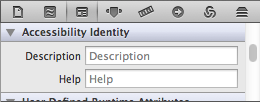

Frank can be used to write tests for Mac apps as well as iOS apps. Writing tests for Mac apps is similar to writing tests for iOS apps, but there are important differences.

## Requirements

Frank can be used to test 64-bit Mac apps on OS X 10.7 and 10.8. Due to the NDA covering the pre-release builds of 10.9, testing on 10.9 is not currently supported. If you need to run tests on 10.9 before the official release, see [this thread](https://groups.google.com/forum/#!topic/frank-discuss/hugP4qelN7s).

The testing machine must have access for assistive devices turned on, as described in [Getting Started](getting_started.html).

## Setup

The steps to Frankify a Mac app are nearly identical to the [steps to Frankify an iOS app](http://blog.thepete.net/blog/2012/06/24/writing-your-first-frank-test/). The one difference is that you must pass a `--mac` flag to `frank build`. The `frank build` command normally compiles the app for running in a simulator. As Mac apps do not run in a simulator, the `--mac` flag will prevent Frank from trying to build your app for a simulator.

## Labeling Views

Frank identifies UIViews based on their `accessibilityLabel` property. However, `accessibilityLabel` does not exist on the Mac. Therefore, Frank defines a `FEX_accessibilityLabel` property on NSObject. By default, this property is equal to the object's accessibility description, which can be set in Interface Builder.

NSMenuItems and NSControls without accessibility descriptions will set their `FEX_accessibilityLabel` to their `title`. You can override `-FEX_accessibilityLabel` to provide a different label for your own objects.

## View Frames

Frank uses the `accessibilityLabel` property to get a view's size and position, which also does not exist on the Mac. Therefore, Frank on the Mac adds a `FEX_accessibilityFrame` property to NSObject, which is created by combining the object's `NSAccessibilityPositionAttribute` and `NSAccessibilitySizeAttribute`. If your object does not have these accessibility attributes, you will need to override `-FEX_accessibilityFrame`.

If you override `-FEX_accessibilityFrame`, it should return a rect assuming that the origin point (0, 0) is at the top-left, rather than bottom-left of the screen. Although Cocoa's origin point is in the bottom-left, the accessibility API and the CGEvent API (which is used to create mouse events) assume the origin is in the top-left.

## View Hierarchy

Frank on iOS builds a hierarchy of view objects by starting with the application's `keyWindow`, adding its `subviews`, and their `subviews`, and so on, recursively. The Mac, however, has a variety of objects which do not inherit from NSView, such as NSWindow, NSMenuItem, and various view cells.

The root of the view hierarchy on the Mac is the shared NSApplication object. Its children are the application's windows, its menu bar, and its contextual menus.

In order to build this view hierarchy, Frank adds two properties to NSObject on the Mac, `FEX_parent` and `FEX_children`. When implementing a custom view class with cells, you will need to wrap those cells in objects which implement `FEX_accessibilityLabel` and `FEX_accessibilityFrame`.

When overriding `FEX_children`, take care to only add children which are visible to the user. Views present in a scroll view, but which are outside of the view's visible bounds, should not be included. Some views, like view-based NSTableViews, do not create subviews for objects which are not visible, so your views should do the same for consistency.

## The `bring_to_front` and `simulate_click` Functions

Because the Mac can run multiple, overlapping apps, Frank needs a way to bring your application and its individual windows to the foreground. The `bring_to_front` function can be passed an NSApplication, an NSWindow, or an NSView. When passed an NSView, it will call `bring_to_front` on that view's NSWindow.


  bring_to_front "view:'NSApplication' marked:'TestApp'"
  bring_to_front "view:'NSWindow' marked:'Untitled 1'"


Most mouse functions should only be called on objects that are visible in the frontmost window. However, `simulate_click` is an exception to this rule. This function does not create any mouse events, but by default performs `NSAccessibilityPressAction` on the object. NSMenuItem and other classes which do not support `NSAccessibilityPressAction`  implement `-FEX_simulateClick` to perform an action when `simulate_click` is called on them. See the documentation for more details.

While `simulate_click` can be safely called on all objects in the background, not all objects will respond to actions while in the background. Using frank console to call simulate_click on an object is a good way to test whether that object will respond while in the background.

## The `click`, `double_click` and `drag_with_initial_delay` Functions

The remaining mouse functions simulate actual mouse events. While running tests that use these functions, it is important to not move the mouse. This means that while the tests are running, you cannot use your computer to do other things. For this reason, you may want to run your tests on another machine or in a virtual machine.

## The Keyboard Functions

The keyboard functions `type_into_keyboard` and `type_shortcut` can be called while the application is in the background. The keyboard events are limited to your app. However, menu shortcuts will not work when the app is in the background. If you want a menu item to perform its action when the app is in the background, use `simulate_click`.

## Contextual Menus

Contextual menus can be opened using calling the `show_menu` function on an object that spawns contextual menus. Contextual menus do not fit well into the view hierarchy, and so Frank considers them to be the children of the shared NSApplication instance, instead of the right-clicked object. In addition, contextual menus items are only visible to Frank while their menu is open.

## Functions That Don't Work on the Mac

Most functions that work on iOS also work on the Mac. However, there are a few that do not. Most notably, the touch functions, the `fill_in` function, and the functions that deal with animation are currently iOS-only.

On iOS, all views are backed by CALayers. This is not always true on OS X, and OS X has multiple ways to animate a view. If you need to test whether your views are animating, you'll need to implement a test appropriate for how you are animating your views.
